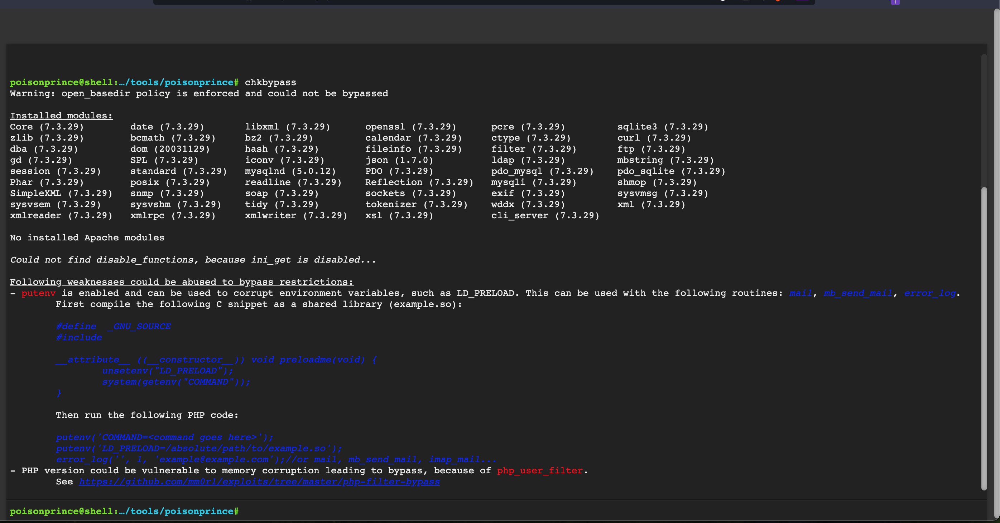
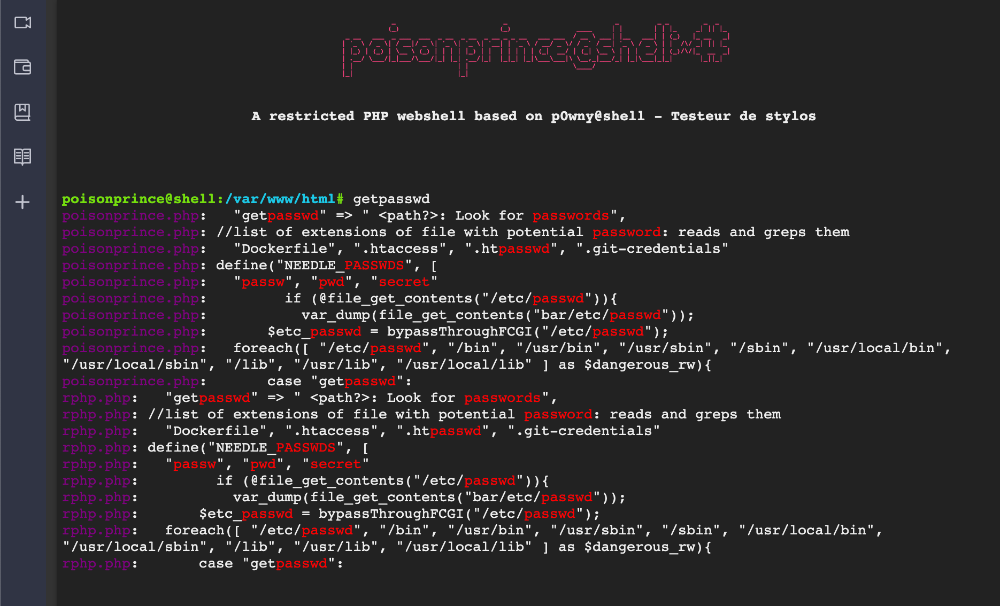
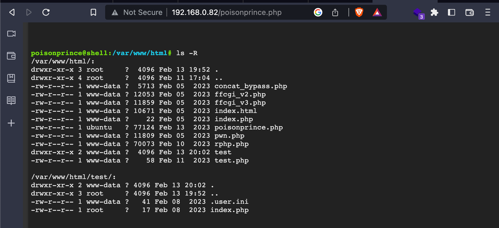
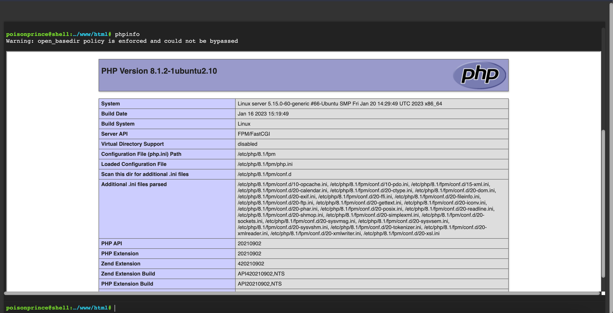
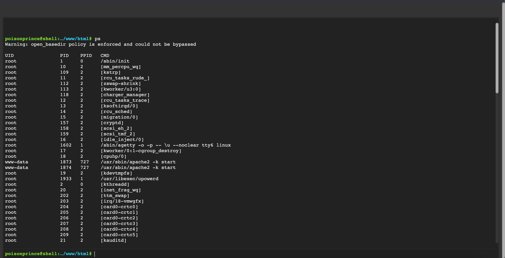

# Poison Prince

There is nothing more frustrating than obtaining a remote code execution on a PHP webapp and being constrained by `disable_functions` while performing an intrusion test... This shell tries to offer useful features for post-exploitation, **_while no exec-like functions are allowed_**.

This shell is protected by a password, and because of lack of imagination, default credentials are `poisonprince:poisonprince`. You may want to change it before uploading the shell, because leaving it unprotected on a server is a security hole. This shell is meant to evaluate the strength of an already hardened server (but maybe not sufficiently). **Use it with caution. Do no harm.**

So of course features are quite limited and may be broken if `disable_functions` forbids the use of too much routines, and `open_basedir` cannot be bypassed.

Let's render upon to Ceasar with is Ceasar's: the layout and some features come from the [p0wny@shell:~# ](https://github.com/flozz/p0wny-shell) project, a single-file PHP webshell. The p0wny@shell project is licensed under the [WTFPL](https://github.com/flozz/p0wny-shell/blob/master/LICENSE)

:construction:

Work in progress ... I try to add new bypass techniques and commands on a regular basis. Still, the shell may misbehave if some functions it uses are also disabled, although they are not exec-like. For the moment, Windows servers are not supported.

## Manual

To begin with, press `?` or `help` or nothing to get help.

If the command you typed fails, it may be because of the following reasons:
* `open_basedir` is enforced and you tried to read/write beyond the scope it allows
* lack of permissions
* you used quotes and spaces in your file paths, and sorry, but it is not perfectly handled yet ...
* 

_Order of the argument DOES matter_

### `cat`

Reads a file, like the command you already know.\
Usage: is `cat </path/to/file>`

The path can be relative.

### `cd`

Changes the current working directory.\
Usage: `cd <destination?>`

The path can be relative.

If `destination` is null, it tries to go to the home directory, if any.

You do not need to put quotes if path contains spaces, but autocompletion may fail.

### `chkbypass`

Tries to find ways to evade `disable_functions`, based on installed modules and versions.\
Usage: `chkbypass <-k?>` 

If the switch `-k` is set, it skips versions check and only verifies installed modules and stuff

### `clear`

Client-side command, it clears the console

### `download` 

Downloads a file (**not a whole folder**)\
Usage: `download <file>`

### `echo`

Echoes something to a file\
Usage: `echo <what> > <outfile>` or `echo <what> >> <outfile>` to append.

You can use `\n` to write carriage returns, cuz the shell """stdin""" is a single line.

### `env`

Displays the environment variables\
Usage: `env`

### `eval`

Evaluates the given PHP code, just as the `eval` routine in PHP does (no need to put the `<?php ?>` markers then):\
Usage: `eval <code>`

Displays the output if any

### `gethist`

Reads `*_history` files _in the home directory_, or the current one if no home is configured\
Usage: `gethist`

### `getpasswd`

Looks for potential secrets, in the given folder or the current one if none\
Usage: `getpasswd <path?>`

Can be quite slow if the given folder is huge. Prints it like a grep

### `grep`

Looks for a given string, in a given folder (recursively) or file. If the switch `-i` is set, it ignores the case. If the paht is not set, if assumes the current folder\
Usage: `grep <pattern> <path?> <-i?>`

Can be quite slow if the given folder is huge. Prints it like a grep

### `id`

Prints the current user id and name, as well as group info\
Usage: `id`

### `ls` 

List files and directories. If the path is not set, it assumes the current folder. If the switch `-R` is set (off by default), it prints recursively\
Usage: `ls <-R?> <path?>`

### `mkdir`

Creates a directory. IT creates intermediate ones if the don't exist\
Usage: `mkdir <name>`

### `mv`

Renames a file/folder\
Usage: `mv <name> <newname>`

Quotes can be used, but once again, not sure that they are properly handler. And who the hell uses blank spaces in file names ?!

### `phpinfo`

Runs the routine `phpinfo` and puts the output in a frame\
Usage: `phpinfo`

### `ps`

Only works in `/proc` is readable. Lists the running processes\
Usage: `ps`

### `pwd`

Prints the current working directory\
Usage: `pwd`

### `rm`

Beware of this one, a folder could be unintentionally removed ... Removes a file or a folder. If this a folder is deletes recursively\
Usage: `rm <path>`

### `tar`

Compresses a folder, and immediately tries to download it. If no argument is provided, it tar's the current folder\
Usage: `tar <path?>`

### `upload`

Uploads a file/folder. The expected argument is the destination name\
Usage: `upload <name>`

## Future work

* Better handling of quoted values
* More commands
* if `grep` or `getpasswd` has a line matching multiples needles, display it only once
* Make it windows-compatible
* (maybe) automatically try to verify if no-exec bypass work, if possible

## Why Poison Prince ?

I really suck at finding names :disappointed_relieved:

My favourite song is `The Man Who Sold The World`, but the name was a bit too long. Hence I took my number 2